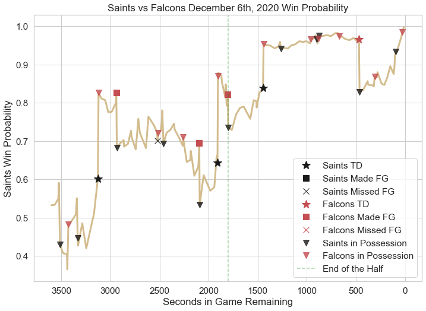

# NFL-Win-Probability-Model

> In this project, I created 5 Win Probability Models for NFL teams based on current game conditions, such as down and distance from the end zone. I employ one of these models to  evaluate the win probability of the New Orleans Saints for their game against the Atlanta Falcons on December 6th, 2020. I visualize their win probability and provide a probability of a field goal kicker making a field goal based on distance from the goalposts.

## Data Preparation

- To obtain data, I use play-by-play data obtained from previously pulled data by the developer of the nflfastR package. This data consists of the years 2011 through 2021 and is specified in  Cell 2 of the notebook.
- In addition to this, I also have to pull schedule data. I use the pyreadr package to read in Rds files from  the same repository.
- Last, I isolate the predictor and response variables. The response variable is whether the team currently in possession of the ball is the winner of the football game. The predictor variables are the following:
  - **ydstogo** - yards to go for a first down
  - **game_seconds_remaining** - seconds in the game left
  - **yardline_100** - yards from scoring
  - **score_differential** - the difference between the score of the team in possession of the ball and the opposing team
  - **half_seconds_remaining** - seconds before the end of the current half
  - **home_timeouts_remaining** - the timeouts remaining for the home team
  - **away_timeouts_remaining** - the timeouts remaining for the away team
  - **adjusted_score** - score differential / sqrt(game_seconds_remaining + 1)
  - **qtr** (one-hot-encoded) - 1st, 2nd, 3rd, or 4th quarter
  - **down** (one-hot-encoded) - 1st, 2nd, 3rd, or 4th down

## Models Used

> All models are built using the scikit-learn library in Python. Additionally, predictors are scaled using Standardization. Last, I exported any models created. These can be found in the models folder of the repository.

- **Logistic Regression**
- Decision Tree
- Random Forest
- Stochastic Gradient Descent Classifier
- K-Nearest Neighbors Classifier

I move forward with the Logistic Regression model.

## Evaluating Win Probability for the Saints versus Falcons

> The graph above provides a breakdown of the Saints' win probability throughout the football game. Black triangles mean the Saints are in possession of the ball, whereas red signifies the Falcons are in possession of the ball. Any time the Saints score (black stars, black squares), their win probability usually goes up. If they miss a field goal, it could be advantageous because it puts the opponent in bad field position (see at 2500 seconds remaining in the game). 

### Other items

> I determined the probability of making a field goal using data obtained in the past 10 NFL seasons from kickers. I had to offset this based on where the kick is taken from and the length of the end zone (see Cell 18). 
>
> **Note**: There are more than 2 outcomes that can occur from a field goal, whether it is made, missed, or blocked.
>
> .png)

## Conclusions

> Win probability models can be leveraged to evaluate various situations on the field. Regardless of this, I firmly believe they should be used as **decision support** and not as an "all-knowing" model. This project only explored the surface of what is possible and with data coming from more heterogenous sources, such as personal tracking, weather, and many more factors, there are more possibilities for optimizing play calling in the NFL.

